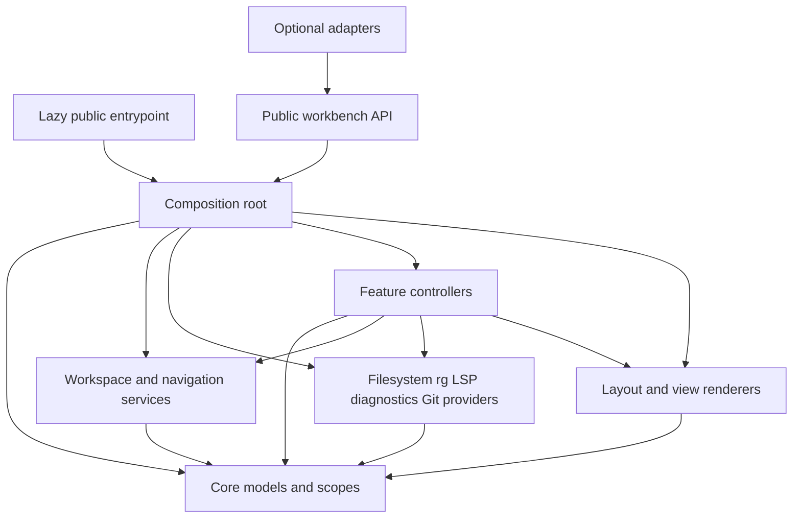

# Workbench Architecture

## Product Boundary

Workbench provides a consistent way to explore a workspace, inspect results, navigate source, discover actions, and control capabilities. Neovim remains the editor and owns text buffers, editing, undo, windows, and its LSP clients. The workbench must run standalone; integrations enhance it without becoming mandatory dependencies.

The architectural unit is a **capability composed from data services, actions, and views**. It is not a collection of plugins hidden behind renamed keybindings. It is also not an editor framework that requires an inheritance hierarchy or container to add a view.

## Composition Model



Arrows mean allowed dependency direction, not data flow. UI code consumes projections and emits intents through callbacks. It does not `require()` a provider. Providers receive workspace snapshots and emit batches; they cannot inspect the current window. Navigation uses a location resolver interface injected by composition, not a direct import of LSP or Files. Cross-feature orchestration lives in controllers.

Use plain Lua modules and explicit `new(deps, opts)` constructors where stateful instances are necessary. Stateless utilities remain functions. Top-level imports of small pure modules within an already lazy-loaded feature are fine. Avoid a global service locator, automatic directory scanning for extensions, hidden `require()` cycles, generic middleware, and event sourcing.

Build only the modules needed by the current task. The directory map is an ownership destination, not a request to create empty files.

```text
plugin/workbench.lua             future cheap command registration only
lua/workbench/init.lua           public setup/execute/open/close APIs
lua/workbench/compose.lua        explicit construction and activation
lua/workbench/core/              resource/location/item contracts; scope; action registry
lua/workbench/services/          workspace, navigation, results, settings, persistence
lua/workbench/providers/         fs, rg, lsp, diagnostics, git
lua/workbench/controllers/       explorer, search, discovery, settings, operations
lua/workbench/ui/                split layout, tree/list projection, preview, palette
lua/workbench/adapters/          fzf, mini-files, quickfix; optional public integrations
lua/workbench/health.lua         diagnostics for actual effective state
tests/                          isolated runtime and planning tests
bench/                          reproducible fixtures and measurement commands
```

## Ownership Matrix

| Owner | Sole responsibility | Explicitly does not own |
|---|---|---|
| `core/scope` | Nested disposal, liveness and registration of owned handles | Feature business logic |
| `services/workspace` | Root identity, root policy, scope snapshots, workspace generation | LSP client startup or global cwd |
| `services/results` | Result-set identity, ordering, active result, retention | Windows or provider execution |
| `services/navigation` | Open/preview/commit/return semantics and destination selection | Text search or filesystem mutation |
| `services/settings` | Validated workbench settings and effective provenance | Editing autoconf's TOML parser or directly configuring Blink |
| Provider instances | Domain requests, normalization, cancellation and caches | Keymaps, UI focus, user settings persistence |
| Feature controllers | Intent handling, invoking providers, updating models | Private provider parsing, low-level window geometry |
| `ui/layout` | Workbench-created windows and their dimensions | User-created editor window lifetime |
| `ui/tree`, `ui/list` | Visible rows and extmarks from stable IDs | Authoritative result data or root detection |
| `autoconf.nvim` | TOML translation, language setup, completion/formatting lifecycle | Explorer selection or search history |
| `themekit.nvim` | Semantic theme token mappings | Provider state or direct UI logic |
| nvim-config | Key choices, submodules, feature rollout and flake wiring | Plugin source histories |
| Nix host config | Third-party packages, binaries, parsers and activation | Ad hoc plugin downloads at editor startup |

Every task names a primary owner plus the repositories it can change. A cross-repository integration task can have several changes, but never makes two components responsible for the same hook. Review must identify the exact module that creates and disposes every new effect.

## State Boundaries

- One application scope per Neovim process. It holds only registries, configuration and lightweight workspace references until a feature is activated.
- One workspace model per stable root-set ID. Multiple tabpages may refer to it. Search content can be shared only through explicit result-set IDs; active result selection is per view session.
- One tab scope per tabpage containing a layout session, return targets, and selected view IDs. A tab's sidebar does not steal another tab's selection.
- One feature scope per activated feature/session. It owns provider subscriptions and caches or leases shared services with reference counts.
- One request scope per request generation. Superseding or cancelling it invalidates every callback even if external cancellation fails.
- One view scope per mounted view. It owns its buffer, mappings, extmarks, render callbacks and UI-only timers. Closing a view preserves bounded model state, not live watchers.

Use mutable owner-local state with a monotonically increasing revision. Publish small typed changes or read-only projections. Lua does not enforce immutability: callers must not mutate snapshots, and tests use defensive assertions where useful. Do not deep-copy the whole workspace for each cursor movement. Subscription lists are local to a service; notifications have a named schema and cannot trigger uncontrolled global cascades.

## Lifetime Rules

`Scope:dispose()` marks dead first, cancels owned children, then releases effects in reverse registration order. It is idempotent, continues cleanup after a disposer fails, and reports bounded errors. A scope refuses new effects after disposal. Shared resources have explicit leases so closing one sidebar does not cancel another consumer's request.

Providers may complete after cancellation. A callback may commit only when `scope.alive`, request generation, workspace generation, and any required document version still match. Test the queued callback after disposal, not just process termination. All Neovim editor mutations from fast callbacks are scheduled; the scheduled callback repeats liveness checks.

Hidden views have no filesystem watchers or render work. A completed search remains in the result store under an LRU budget. An in-flight search is cancelled on close by default; reopening shows its retained partial state as cancelled and offers rerun. Explicitly pinned completed result sets are retained within the same budget, not indefinitely.

## One Model, Several Shapes

Share resource identity, locations, action IDs, capability state, and result identity. Keep filesystem trees, document symbols, and call hierarchies as distinct domain structures projected into a common visible-row contract. A call hierarchy can contain cycles and multiple edges to the same target; treating it as a path tree loses information. A settings row is not a fake file node.

The reusable tree primitive provides expansion state, parent navigation, filtering visibility and stable selection. A feature supplies child-loading and labels. Introduce it using Files first, then prove the interface using Outline. Do not generalize to arbitrary graphs until call hierarchy needs edge identity.

## Event Inventory

| Event | Owner and activation | Work permitted |
|---|---|---|
| `ColorScheme` | Application theme adapter, one hook | Relink semantic groups; no provider refresh |
| `VimResized` | Layout while mounted | Coalesced geometry calculation |
| `WinClosed`, `TabClosed` | Layout/application lifecycle | Dispose matching IDs; constant-time lookup |
| `LspAttach`, `LspDetach` | Discovery while enabled | Invalidate buffer capability snapshot |
| `DiagnosticChanged` | Diagnostics while subscribed | Update changed buffer/namespace projection |
| `BufWritePost` | Buffer-scoped relevant provider lease | Mark that file or parent dirty |
| Buffer change attachment | Visible Outline or dirty search overlay | Invalidate version; debounce work |
| Workbench view cursor/scroll events | Buffer-local to view | Update selection/viewport only |

Follow-active-file behavior is opt-in and uses one scoped navigation observer while visible. If buffer/window events cannot be narrowed by pattern, document the lifecycle exception, constant-time inactive predicate, and disposal test before adding them. Root detection and recursive scans never run on generic `BufEnter`.

## Public API And Compatibility

Contract version 1 is a design target. Expose `setup(config)`, `execute(action_id, args)`, `open(view_id, opts)`, `close(view_id)`, `get_status()`, and contribution registration with disposable handles. Runtime capability names and action IDs are stable once released; constructors and storage tables remain private.

An integration adds metadata and a handler through the public registry. It cannot require `controllers/*` or modify `_state`. New public fields require contract tests and documentation. Errors use structured codes with a short user message and optional debug details. The status API must report disabled, missing dependency, unsupported, loading, error and ready distinctly.
